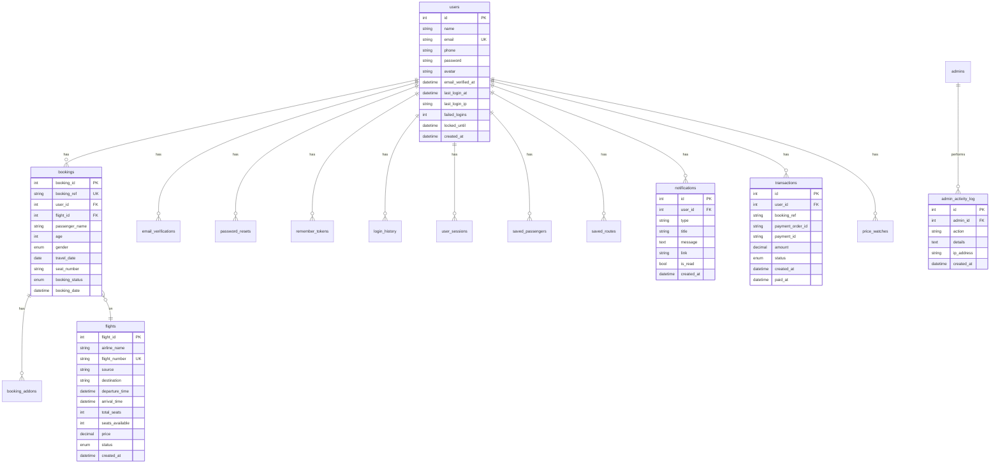

# AeroBook — Architecture Overview

## System Architecture

AeroBook follows a **modular monolithic architecture** designed for shared hosting environments. It uses a standard LAMP stack with no framework dependencies.

```
┌─────────────────────────────────────────────────────────────┐
│                    Browser (User/Admin)                      │
└──────────────────┬──────────────────────────────────────────┘
                   │ HTTP/HTTPS
┌──────────────────▼──────────────────────────────────────────┐
│                    Apache (mod_rewrite)                       │
│  ┌──────────────┬──────────────┬─────────────────────────┐  │
│  │  Public Pages│  Admin Pages │   Static Assets          │  │
│  │  *.php       │  admin/*.php │   css/, js/, uploads/   │  │
│  └──────┬───────┴──────┬───────┴─────────────────────────┘  │
└─────────┼──────────────┼────────────────────────────────────┘
          │              │
┌─────────▼──────────────▼────────────────────────────────────┐
│                    PHP Application Layer                      │
│  ┌──────────────────────────────────────────────────────┐   │
│  │  includes/                                              │   │
│  │  ┌──────────┐ ┌──────────┐ ┌──────────┐ ┌─────────┐ │   │
│  │  │ config   │ │functions │ │ helpers  │ │  Auth   │ │   │
│  │  │ .php     │ │ .php     │ │ .php     │ │ .php    │ │   │
│  │  └──────────┘ └──────────┘ └──────────┘ └─────────┘ │   │
│  │  ┌──────────┐ ┌──────────┐ ┌──────────┐ ┌─────────┐ │   │
│  │  │ Security │ │Validatn │ │ Logger   │ │ErrorHnd │ │   │
│  │  │ .php     │ │ .php     │ │ .php     │ │ .php    │ │   │
│  │  └──────────┘ └──────────┘ └──────────┘ └─────────┘ │   │
│  │  ┌──────────┐ ┌──────────┐ ┌──────────┐ ┌─────────┐ │   │
│  │  │ Mailer   │ │ QRCode   │ │  PDF     │ │Payment  │ │   │
│  │  │ .php     │ │ .php     │ │ .php     │ │ .php    │ │   │
│  │  └──────────┘ └──────────┘ └──────────┘ └─────────┘ │   │
│  │  ┌──────────┐ ┌──────────┐ ┌──────────┐ ┌─────────┐ │   │
│  │  │  ICS     │ │Notificat│ │ Avatar   │ │  Cache  │ │   │
│  │  │ .php     │ │ .php     │ │ .php     │ │ .php    │ │   │
│  │  └──────────┘ └──────────┘ └──────────┘ └─────────┘ │   │
│  └──────────────────────────────────────────────────────┘   │
└───────────────────────────┬──────────────────────────────────┘
                            │
┌───────────────────────────▼──────────────────────────────────┐
│                    MySQL Database                             │
│  ┌──────────┐ ┌──────────┐ ┌──────────┐ ┌────────────────┐ │
│  │  users   │ │ flights  │ │bookings  │ │notifications   │ │
│  └──────────┘ └──────────┘ └──────────┘ └────────────────┘ │
│  ┌──────────┐ ┌──────────┐ ┌──────────┐ ┌────────────────┐ │
│  │transact.│ │saved_rts│ │price_wat│ │login_history   │ │
│  └──────────┘ └──────────┘ └──────────┘ └────────────────┘ │
│  ┌──────────┐ ┌──────────┐ ┌──────────┐ ┌────────────────┐ │
│  │sessions  │ │book_addon│ │contacts  │ │admin_activity  │ │
│  └──────────┘ └──────────┘ └──────────┘ └────────────────┘ │
└──────────────────────────────────────────────────────────────┘
```

## Request Flow

1. **Apache** receives the HTTP request and routes to `.php` files
2. **`includes/config.php`** bootstraps error handling, loads `.env` (if present), detects environment, configures session, connects to MySQL
3. **`includes/header.php`** emits security headers, renders nav bar (with notification bell for logged-in users)
4. **Page-specific PHP** handles the request logic (form submission, database queries, business logic)
5. **`includes/helpers.php`** provides reusable database functions (30+ prepared-statement helpers)
6. **`includes/footer.php`** renders footer and loads JS
7. **Admin pages** use `admin/includes/admin-header.php` which requires admin authentication

## Database Schema (ER Diagram)

### Mermaid Diagram (Renders natively on GitHub)



### ASCII Diagram (Fallback)

```
┌─────────────────────────────────────────────────────────────────┐
│                           users                                  │
├─────────────────────────────────────────────────────────────────┤
│ id (PK) │ name │ email (U) │ phone │ password │ avatar │        │
│ email_verified_at │ last_login_at │ last_login_ip │              │
│ failed_logins │ locked_until │ created_at                        │
└──────────┬──────────────────────────────────────────────────────┘
           │ 1
           │
           │ *
┌──────────▼──────────────────────────────────────────────────────┐
│                          bookings                                │
├─────────────────────────────────────────────────────────────────┤
│ booking_id (PK) │ booking_ref (U) │ user_id (FK) │ flight_id   │
│ passenger_name │ age │ gender │ travel_date │ seat_number       │
│ booking_status (Confirmed/Cancelled) │ booking_date             │
└──────────┬──────────────────────────────────────────────────────┘
           │ *
           │
           │ 1
┌──────────▼──────────────────────────────────────────────────────┐
│                         flights                                  │
├─────────────────────────────────────────────────────────────────┤
│ flight_id (PK) │ airline_name │ flight_number (U) │ source      │
│ destination │ departure_time │ arrival_time │ total_seats       │
│ seats_available │ price │ status │ created_at                   │
└─────────────────────────────────────────────────────────────────┘

┌─────────────────────────────────────┐
│        email_verifications          │
├─────────────────────────────────────┤        ┌─────────────────┐
│ id (PK) │ user_id (FK) │ token     │        │ password_resets │
│ expires_at │ used │ created_at     │        ├─────────────────┤
└─────────────────────────────────────┘        │ id (PK) │ uid   │
                                               │ token │ expires  │
┌─────────────────────────────────────┐        │ used │ created   │
│        remember_tokens              │        └─────────────────┘
├─────────────────────────────────────┤
│ id (PK) │ user_id (FK) │ token_hash│        ┌─────────────────┐
│ expires_at │ created_at             │        │  login_history  │
└─────────────────────────────────────┘        ├─────────────────┤
                                               │ id │ user_id    │
┌─────────────────────────────────────┐        │ email │ ip      │
│        user_sessions                │        │ user_agent      │
├─────────────────────────────────────┤        │ success │ time  │
│ id (PK) │ user_id (FK) │ session_  │        └─────────────────┘
│ identifier │ ip │ user_agent │      │
│ device_name │ is_active │ logged_in│        ┌─────────────────┐
│ last_activity                        │        │ notifications   │
└─────────────────────────────────────┘        ├─────────────────┤
                                               │ id (PK) │uid(FK)│
┌─────────────────────────────────────┐        │ type │ title    │
│        saved_passengers             │        │ message │ link  │
├─────────────────────────────────────┤        │ is_read │ created│
│ id (PK) │ user_id (FK) │ name      │        └─────────────────┘
│ age │ gender │ created_at           │
└─────────────────────────────────────┘        ┌─────────────────┐
                                               │  transactions   │
┌─────────────────────────────────────┐        ├─────────────────┤
│        booking_addons               │        │ id │ user_id    │
├─────────────────────────────────────┤        │ booking_ref    │
│ id (PK) │ booking_id (FK)          │        │ demo_order │
│ addon_type │ addon_name │ amount    │        │ demo_pay_id│
└─────────────────────────────────────┘        │ amount │ status │
                                               │ paid_at│created │
┌─────────────────────────────────────┐        └─────────────────┘
│        saved_routes                 │
├─────────────────────────────────────┤        ┌─────────────────┐
│ id (PK) │ user_id (FK) │ source    │        │  price_watches  │
│ destination │ label │ created_at   │        ├─────────────────┤
│ UNIQUE (user, source, destination)  │        │ id │ uid (FK)  │
└─────────────────────────────────────┘        │ source │ dest   │
                                               │ max_fare │ month│
┌─────────────────────────────────────┐        │ created_at      │
│        contacts                     │        └─────────────────┘
├─────────────────────────────────────┤
│ id (PK) │ name │ email │ subject   │        ┌─────────────────┐
│ message │ created_at                │        │admin_activity   │
└─────────────────────────────────────┘        ├─────────────────┤
                                               │ id │ admin_id   │
┌─────────────────────────────────────┐        │ action │ details│
│        admins                       │        │ ip_address      │
├─────────────────────────────────────┤        │ created_at      │
│ admin_id (PK) │ username (U)       │        └─────────────────┘
│ password │ created_at               │
└─────────────────────────────────────┘
```

## Key Design Decisions

### Why No Framework?
- **Shared hosting compatibility** — Laravel/Symfony have higher server requirements
- **Lightweight** — Zero framework overhead, faster page loads
- **Simplicity** — Anyone with basic PHP knowledge can understand and modify the code
- **No lock-in** — Easy to migrate to Laravel later if needed

### Prepared Statements Everywhere
Every SQL query uses prepared statements with parameterized inputs. This eliminates SQL injection risk entirely.

### CSRF on Every Form
All POST forms include a CSRF token. Admin GET-based delete operations now use one-time tokens with 15-minute expiry.

### Transactional Booking
The booking flow uses `mysqli_begin_transaction()` with `FOR UPDATE` row locking to prevent double-booking in concurrent requests.

### Lazy Loading Configuration
Configuration loads from `.env` file, system environment variables, or hardcoded defaults (in that order). No performance penalty — the `.env` file is <1KB and parsed in <1ms.

### Request-Level Caching
`AeroCache` provides lightweight static caching for expensive queries (dashboard KPIs, analytics data, route stats). Cache lives only for the current request — no file/Redis dependency.

## Performance Optimizations

- **13 database indexes** covering all query patterns
- **Browser caching** via `.htaccess` (1 year for CSS/JS/images)
- **CDN assets** — Bootstrap, Bootstrap Icons, Google Fonts
- **Lazy image loading** via `loading="lazy"` + IntersectionObserver
- **Print-optimized CSS** for clean ticket/invoice printing
- **Reduced motion** support for accessibility

## Security Architecture

```
┌─────────────────────────────────────────────────────────────────┐
│                   Security Layers                                │
├─────────────────────────────────────────────────────────────────┤
│ 1. .htaccess — CSP, XSS, clickjacking, directory protection     │
│ 2. emitSecurityHeaders() — programmatic header emission         │
│ 3. Prepared statements — 100% SQL injection prevention          │
│ 4. CSRF tokens — All POST forms + admin GET deletes            │
│ 5. Input validation — Server-side via Validation.php            │
│ 6. Output escaping — htmlspecialchars() on all dynamic output   │
│ 7. Rate limiting — Login, register, forgot password, admin      │
│ 8. Account locking — 5 failed attempts → 30 min lock           │
│ 9. Session hardening — HTTPOnly, SameSite, regeneration        │
│10. Password hashing — password_hash(PASSWORD_DEFAULT)           │
│11. File upload validation — MIME via finfo, dimensions, size   │
│12. Error handling — friendlier messages, no stack traces       │
│13. Logging — logSecurity() for auth failures, logInfo() for    │
│     critical events, no sensitive data logged                  │
└─────────────────────────────────────────────────────────────────┘
```

## Integration Architecture

```
┌──────────┐    ┌──────────┐    ┌──────────┐    ┌──────────┐
│  Mailer  │    │  Payment │    │  QRCode  │    │    PDF   │
│ .php     │    │ .php     │    │ .php     │    │ .php     │
└────┬─────┘    └────┬─────┘    └────┬─────┘    └────┬─────┘
     │               │               │               │
     │ SMTP/cURL     │ cURL API      │ Pure PHP      │ HTML/tFPDF
     │ fallback: log │ fallback: sim │ SVG output    │ fallback: HTML
     ▼               ▼               ▼               ▼
┌──────────────────────────────────────────────────────────────┐
│                    Application Pages (callers)                 │
│ booking-confirmation.php, register.php, login.php,            │
│ cancel-booking.php, profile.php, generate-ticket.php          │
└──────────────────────────────────────────────────────────────┘
```

Each integration library:
1. **Has zero external dependencies** in fallback mode
2. **Gracefully degrades** when the external service is unavailable
3. **Never stores sensitive data** (passwords, card numbers, full request bodies)
4. **Logs all operations** via the centralized Logger
