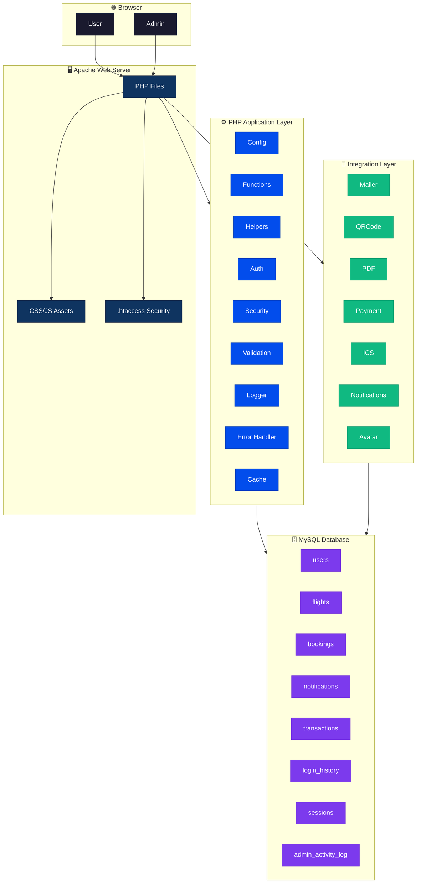
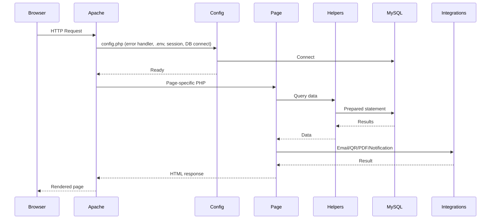
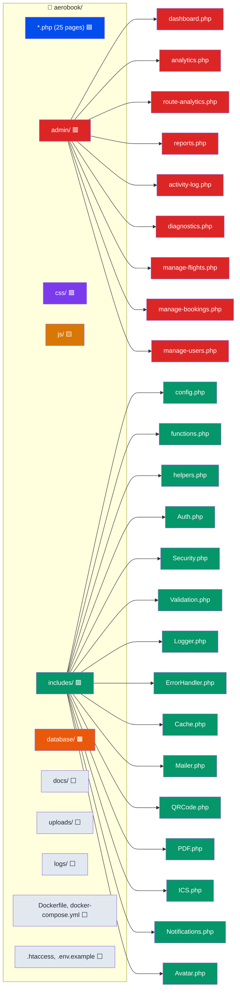

# ✈️ AeroBook — Airline Reservation & Flight Operations Platform

[](https://php.net)
[](https://mysql.com)
[](https://getbootstrap.com)
[](Dockerfile)
[](CONTRIBUTING.md)
[](LICENSE)
[](#)
[](https://github.com/suman2308/airline-reservation-system)

> **AeroBook** is a full-stack airline reservation and flight operations management platform. It provides an end-to-end flight booking engine featuring a real-time 2D aircraft seat map, Smart Fare Engine with connecting flight discovery, a Travel Hub for journey management, and an airline Operations Center for administration. Built with PHP 8+, MySQL, and Bootstrap 5.

[🚀 Quick Start](#-quick-start) •
[📖 Documentation](#-documentation) •
[🏛️ Architecture](#-architecture) •
[🗺️ Roadmap](#-roadmap) •
[🤝 Contributing](#-contributing)

---

## 📊 Feature Comparison

| Feature | AeroBook | Basic Booking Systems | Enterprise Solutions |
|---------|:--------:|:---------------------:|:--------------------:|
| **Interactive Seat Map** | ✅ Real-time 2D cabin | ❌ Text-only | ✅ |
| **Smart Fare Engine** (Connecting Flights) | ✅ Scoring + badges | ❌ Direct only | ✅ |
| **Multi-Passenger Booking** (1–6) | ✅ Dynamic forms | ✅ | ✅ |
| **In-Flight Add-Ons** | ✅ Baggage + Meals | ❌ | ✅ |
| **Promo Code Engine** | ✅ Real-time discounts | ❌ | ✅ |
| **QR Code Boarding Pass** | ✅ Scannable SVG | ❌ | ✅ |
| **Travel Hub Dashboard** | ✅ Stats + milestones | ❌ | ✅ |
| **Email Integration** | ✅ PHPMailer | ❌ | ✅ |
| **Payment** | ✅ Demo (Simulated) | ❌ | ✅ |
| **Admin Operations Center** | ✅ 16-page panel | ❌ Basic CRUD | ✅ |
| **Airline Analytics** | ✅ Revenue + trends | ❌ | ✅ |
| **CSV Reports** | ✅ 5 report types | ❌ | ✅ |
| **Activity Log / Audit Trail** | ✅ Search + filter | ❌ | ✅ |
| **Docker Support** | ✅ docker-compose | ❌ | ✅ |
| **Shared Hosting Compatible** | ✅ Zero dependencies | ✅ | ❌ |
| **No Framework Required** | ✅ Pure PHP 8+ | ✅ | ❌ |

---

## 🏛️ Architecture

### System Overview



### Request Flow



---

## 📁 Folder Structure



---

## 🗄️ Database Schema


---

## ✨ Major Features

### 🇮🇳🌍 Domestic & International Portals

| Portal | Description |
|--------|-------------|
| **🇮🇳 Domestic Flights** | Search flights across 30+ Indian cities. Shows domestic routes, filters by domestic connections only. |
| **🌍 International Flights** | Search international routes. Filters for cross-border itineraries. |

Both portals use the **same booking engine**. The region filter is applied automatically — no duplicate logic.

### 👨‍✈️ Passenger Portal

| Feature | Description |
|---------|-------------|
| **Smart Fare Engine** | Finds valid connecting flights (e.g., Delhi→Mumbai→Goa) when direct flights are expensive. Scores by price, duration, stops, and layover. |
| **Interactive Seat Map** | Real-time 2D Airbus A320 cabin layout. Business (rows 1–2) and Economy (rows 3–10) with window/aisle/middle indicators, exit-row legroom, and occupied status. |
| **Multi-Passenger Booking** | Book 1–6 passengers simultaneously with dynamic form generation, auto-seat assignment, and saved passenger quick-select. |
| **In-Flight Add-Ons** | Baggage upgrades (+10kg/+20kg) and meal preferences (Vegetarian, Non-Veg, Jain Thali) with live price recalculation. |
| **Promo Code Engine** | Instant promo code verification (`AERO10` = 10% off, `FLY2026` = ₹500 off) with live fare summary updates. |
| **Booking Confirmation** | Professional confirmation page with QR code, Google Calendar export, and notification. |
| **E-Ticket / Boarding Pass** | Printable boarding pass with QR code, print-optimized CSS, and calendar export link. |
| **Travel Hub** | Centralized dashboard with upcoming trip timeline, travel statistics, milestones, saved routes, and price watches. |
| **Travel Calendar** | Monthly calendar view of upcoming flights with trip highlighting and one-click booking details. |
| **Travel Documents** | Centralized access to boarding passes, e-tickets, and trip summaries. |
| **Account Management** | Profile, avatar (WebP), password change, email verification, login history, session management. |
| **Flight Status Tracker** | Real-time flight status lookup by flight number or route with gate, terminal, and weather. |

### 🧠 Smart Fare Engine

When a user searches for a route, AeroBook goes beyond direct flights — it intelligently searches for valid two-flight connecting itineraries.

**Algorithm:**
1. Find all direct flights matching the route
2. Find all indirect connections via every intermediate city
3. Validate each connection: second flight departs after first arrives, 1h–6h layover, no duplicate airports
4. Score every itinerary:

| Factor | Weight | Why |
|--------|--------|-----|
| 💰 **Price** | 40% | Lower fare = higher score |
| ⏱️ **Travel Time** | 25% | Shorter journey = higher score |
| 🔢 **Number of Stops** | 20% | Fewer stops = higher score |
| ⏳ **Layover Duration** | 15% | Shorter layover = higher score |

5. Display badges: 🏆 **Best Value**, 💰 **Cheapest**, ⚡ **Fastest**
6. Show **"Save ₹X,XXX"** when a connection beats the cheapest direct flight
7. Explain **"Why This Is Cheaper"** — never fabricates data

> **Configuration:** Min layover: 1h, Max layover: 6h, Max connections: 1.

### 📧 Email System

AeroBook supports transactional emails for:
1. **Email Verification** — Sent after registration to verify the user's email address
2. **Password Reset** — Sent when a user requests a password reset link

Email delivery is handled by `AeroMailer` (in `includes/Mailer.php`):
- **SMTP mode:** Sends real emails via PHPMailer (requires manual install to `lib/phpmailer/`)
- **Log mode (default):** Emails are written to `logs/email.log` — never crashes the application

Configure via `.env`:
```
MAIL_MODE=log
MAIL_HOST=smtp.gmail.com
MAIL_PORT=587
MAIL_USER=your@email.com
MAIL_PASS=your-app-password
MAIL_ENCRYPTION=tls
```

### 🏢 Admin Operations Center

| Page | What It Does |
|------|-------------|
| **Operations Dashboard** | 4 KPI cards, Boarding Soon, Upcoming Departures, Recent Bookings, Low Occupancy Alerts, Top Customers, Data Quality |
| **Airline Analytics** | Revenue by month/route/airline, occupancy analysis, top customers, booking/cancellation trends |
| **Route Analytics** | Profitability, inactive routes, occupancy distribution (high/medium/low/empty) |
| **Download Reports** | CSV exports for bookings, flights, revenue, passengers, routes with date range filters |
| **Activity Log** | Searchable admin audit trail with action filter, date range, pagination |
| **System Diagnostics** | Database status, PHP info, app stats, 7 automated data quality checks |
| **Flight Management** | CRUD + search + status/airline/route filters + occupancy progress bars |
| **Seat Management** | Per-flight seat count and status updates |
| **Booking Management** | Search, status filter, confirmed/cancelled stat badges, admin cancellation |

### 🔌 Integrations

| Integration | Status | Details |
|-------------|--------|---------|
| **Email (PHPMailer)** | ✅ Backend complete | 4 HTML templates, log fallback |
| **QR Code Generator** | ✅ Complete | Scannable SVG, standard byte encoding |
| **PDF Documents** | ✅ Backend complete | Boarding pass/invoice/summary, tFPDF optional |
| **Demo Payment** | ✅ Backend complete | Simulated mode, cURL API, transaction storage |
| **ICS Calendar** | ✅ Complete | RFC 5545 ICS + Google Calendar links |
| **In-App Notifications** | ✅ Complete | Create, fetch, mark read, header dropdown, center page |
| **Avatar Upload** | ✅ Complete | MIME via finfo, WebP, dimension/size validation |

---

## 🧱 Technology Stack

| Layer | Technology |
|-------|-----------|
| **Frontend** | HTML5, CSS3 (Variables, Flexbox/Grid, Animations), Bootstrap 5.3, Bootstrap Icons, Vanilla JS (ES6+) |
| **Backend** | PHP 8.0+ (Prepared Statements, Sessions, CSRF, Transactions) |
| **Database** | MySQL 8.0 / MariaDB (InnoDB, Foreign Keys, 13 Indexes) |
| **Server** | Apache 2.4+ (mod_rewrite, mod_headers, mod_expires) |
| **Payments** | Demo Payment (Test Mode, cURL) |
| **Email** | PHPMailer (SMTP, optional) |
| **PDF** | tFPDF (optional, falls back to HTML) |
| **Deployment** | Docker, Shared Hosting, Manual Apache |

---

## 🚀 Quick Start

### Prerequisites
- PHP 8.0+ with `mysqli`, `gd`, `json`, `mbstring` extensions
- MySQL 8.0 / MariaDB
- Apache 2.4+ with mod_rewrite

### Deploy on Render (recommended)

AeroBook ships a `render.yaml` Blueprint + `Dockerfile` for one-click deployment on [Render](https://render.com):

1. Push this repo to GitHub → **dashboard.render.com/blueprints → New Blueprint Instance**.
2. Select this repository — Render reads `render.yaml` automatically.
3. Provide your external MySQL credentials (`DB_HOST`, `DB_USER`, `DB_PASS`, `DB_NAME`). Render doesn't offer managed MySQL — see [docs/DEPLOY_RENDER.md](docs/DEPLOY_RENDER.md) for free MySQL options.
4. Click **Apply** → verify `https://aerobook.onrender.com/health.php` returns `{"status":"ok",...}`.

### Standard Installation

```bash
# Clone the repository
git clone https://github.com/suman2308/airline-reservation-system.git
cd airline-reservation-system

# Create database and import schema
mysql -u root -p -e "CREATE DATABASE aerobook_db"
mysql -u root -p aerobook_db < database/aerobook.sql

# Configure environment (edit .env with your credentials)
cp .env.example .env

# Set directory permissions
chmod -R 775 uploads/ logs/

# Visit http://localhost/airline-reservation-system
```

### Docker Installation

```bash
docker-compose up -d --build
# Visit http://localhost:8080
```

### Default Credentials

| Portal | Username | Password |
|--------|----------|----------|
| **Admin Panel** | `admin` | `admin123` |
| **User Account** | Register at `/register.php` | — |

---

## 📸 Screenshots

<!-- Screenshots will be placed here in a future update. See screenshots/ directory. -->
> 🖼️ Screenshots coming soon. Install locally or via Docker to explore the full interface.

---

## 📖 Documentation

| Guide | Description |
|-------|-------------|
| 📦 [Installation Guide](docs/INSTALLATION.md) | Step-by-step setup for all environments |
| ⚙️ [Configuration Guide](docs/CONFIGURATION.md) | All config options explained |
| 🚢 [Deployment Guide](PRODUCTION.md) | Production deployment instructions |
| 🌐 [Render Deployment](docs/DEPLOY_RENDER.md) | One-click Render + MySQL setup |
| 🏗️ [Architecture Overview](ARCHITECTURE.md) | System design, ER diagram, decisions |
| 🤝 [Contributing Guide](CONTRIBUTING.md) | How to contribute to AeroBook |
| 🔒 [Security Policy](SECURITY.md) | Security practices and vulnerability reporting |
| 📋 [Changelog](CHANGELOG.md) | Version history and updates |
| 📧 [SMTP Setup](docs/SETUP_SMTP.md) | Email configuration guide |
| 🐳 [Docker Setup](docs/SETUP_DOCKER.md) | Docker deployment guide |
| 💳 [Payment Setup](docs/SETUP_PAYMENT.md) | Demo payment configuration guide |

---

## 🗺️ Roadmap

- [ ] Automated test suite (PHPUnit)
- [ ] REST API for flight search and booking
- [ ] Multi-language support (i18n)
- [ ] Email price watch alerts
- [ ] Real-time WebSocket flight status updates
- [ ] Mobile app (PWA)
- [ ] Admin table pagination for large datasets

---

## 🤝 Contributing

Contributions are welcome! Please read our [Contributing Guide](CONTRIBUTING.md) for details.

This project follows:
- [PSR-12](https://www.php-fig.org/psr/psr-12/) coding standards
- Prepared statements for all SQL
- CSRF protection on all forms
- `htmlspecialchars()` for all output

## 🛡️ Security

We take security seriously. See our [Security Policy](SECURITY.md) for vulnerability reporting.

## 📄 License

Distributed under the MIT License. See [LICENSE](LICENSE).

---

## 🙏 Credits

- **Bootstrap 5** • **Bootstrap Icons** • **Google Fonts (Inter, Outfit)**
- **Demo Payment System** • **PHPMailer** • **tFPDF**

---

<p align="center">
  <strong>Built with ❤️ for the open-source community.</strong><br>
  <sub>⭐ Star this repository if you find it useful!</sub>
</p>
